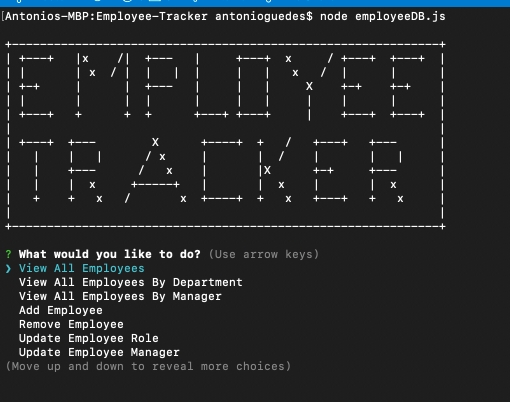

# Employee Tracker


  ## Description
  A Node application that prompts the user about his companie employees and provide many diffrent options.
  To architect and build a solution for managing a company's employees using node, inquirer, and MySQL.
  
  ## Table of contents
  
  * [Installation](#installation)
  * [Usage](#usage)
  * [License](#license)
  * [Contributing](#contributing)
  * [Questions](#questions)
  

  ## Installation
  The user needs to run:
  ```
  npm install
  ```
  in the command line in order to install the required dependencies for this app on your system. 
  The user also need to open the provided schema.sql file and seed.sql in your mySQL workbench.
  Please also note that in order to use this app, you have to change the password the app uses to connect
  
  In order to run this app please type in the command line and execute:
  ```
  node employeeDB.js
  ```

  ## Usage
  The application will prompt the user with different options in how to manage the company employees database:

-   Add departments, roles, employees

-   View departments, roles, employees

-   Update employee roles

-   Update employee managers

-   View employees by manager

-   Delete departments, roles, and employees

-   View the total utilized budget of a department -- ie the combined salaries of all employees in that department

  

  Please click [here](https://drive.google.com/file/d/1hGJstr4FPXz8M642CLtMm9xgpa1vZnmn/view) to see the functionality of this app.

  ## License
  This project is licensed under the MIT.

  ## Contributing
  See [Questions](#Questions) section.

  ## Questions
  If you have any questions about the repo, open an issue or contact me directly at gguedesantonio@gmail.com. 
  You can find more about my work at [Github profile](https://github.com/guedesantonio). 
